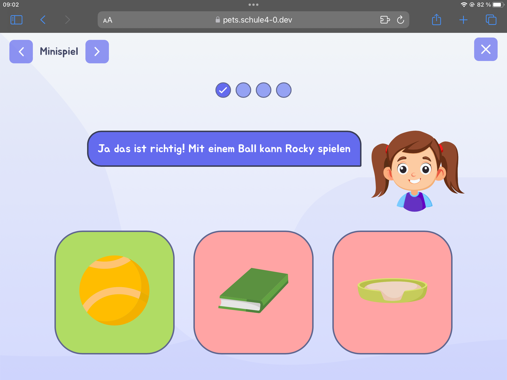

# Schule 4.0 - PETucation

**PETucation** is a web application aimed at teaching first graders how to care for pets responsibly through fun, interactive mini-games. It enhances learning by providing a hands-on experience rather than just reading or listening. The children are guided by Lisa, a virtual mascot, who helps them through the tasks and ensures they can easily follow along with voice instructions.

<p align="center">
 
  
  
</p>

## Live Demo

Check out the live demo of the project: [Schule 4.0 - PETucation](https://pets.schule4-0.dev/)

## Getting Started

### Prerequisites

- Node.js (v14.0.0+ recommended)
- npm (v6.0.0+ recommended)

### Installation

Clone the repository and install dependencies:

```bash
git clone https://github.com/schule4-0/pets.git
cd pets
npm install
```

### Development

Start the development server with hot-reloading:

```bash
npm run dev
```

### Production

Build the project for production:

```bash
npm run build
```

### Linting

Run ESLint to check for code style issues:

```bash
npm run lint
```

## Contributors

This project was developed as part of a university project at [Media University Stuttgart](https://www.hdm-stuttgart.de/), in cooperation with the [University of Education Weingarten](https://www.ph-weingarten.de/) and [Schule 4.0](https://www.schule4-0.de/).

## License

This project is licensed under the [GPL-3.0 License](./LICENSE).
